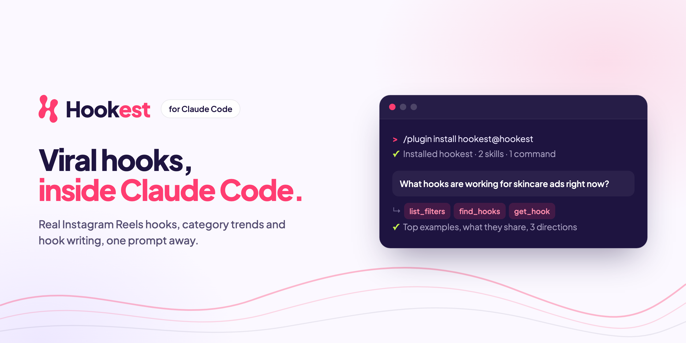
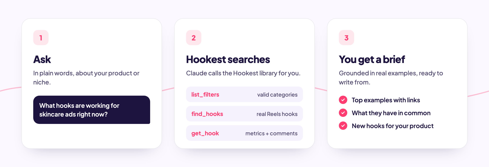

<p align="center">
  <a href="https://hookest.com">
    
  </a>
</p>

<p align="center">
  <a href="https://hookest.com"></a>
  
  
  <a href="LICENSE"></a>
</p>

<p align="center">
  <b>Find real viral Instagram Reels hooks, see which categories are gaining,<br>and write new opening lines for your ads, without leaving Claude Code.</b>
</p>

<br>

## Install

Run these two commands inside Claude Code:

```
/plugin marketplace add wask-co/hookest-plugin
/plugin install hookest@hookest
```

The first time a Hookest tool runs, your browser opens so you can sign in to
Hookest and approve access. A free account is enough to start.

<br>

## How it works

<p align="center">
  
</p>

<br>

## What's inside

| | Name | What it does |
|---|---|---|
| 🔎 | **`hook-research`** skill | Pulls real hooks for your product or niche, opens the best ones for metrics and comment insights, and writes a short brief |
| ✍️ | **`write-hooks`** skill | Writes 5 to 8 hooks for your product, each tied to a real library example, and checks how long each one takes to say |
| 📈 | **`/hookest:trends`** | Shows which categories are gaining or losing momentum, with top examples from the leaders |
| 🔌 | **Hookest MCP** | All Hookest tools: `find_hooks`, `get_hook`, `find_similar_hooks`, `discover_trends`, `generate_hooks`, saved hooks, creator tracking and more |

Skills run on their own when your request matches. You don't need to name them.

<br>

## Try it

```
What hooks are working for skincare ads right now?
```
```
Write 5 hooks for my protein bar Reel. Audience: gym beginners.
```
```
/hookest:trends 30d
```

<br>

## Good to know

- **Instagram Reels only.** The library does not cover TikTok or YouTube yet.
- **Quota.** `generate_hooks`, `lookup_creator` and `search_creators` use your
  Hookest quota. The skills ask you before calling them.
- **Library items only.** Hookest analyses hooks in its library. It cannot
  analyse any Instagram URL you paste.

<br>

## Use Hookest in other apps

The same server works in Claude, ChatGPT and Gemini. Add this address as a
custom connector:

```
https://hookest.com/mcp
```

<br>

<p align="center">
  <a href="https://hookest.com"></a>
  <br>
  <sub>Made by <a href="https://hookest.com">Hookest</a> · MIT licensed</sub>
</p>
